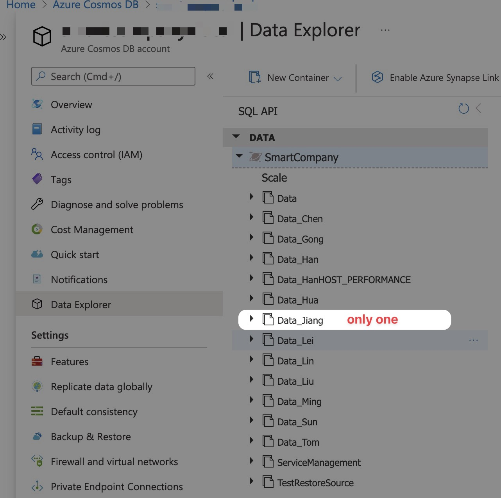

# Azure Helpers

- [Azure Helpers](#azure-helpers)
  - [1. deleteCosmosContainers](#1-deletecosmoscontainers)
- [What tools used?](#what-tools-used)

## 1. deleteCosmosContainers

goto [deleteCosmosContainers.http](./deleteCosmosContainers/deleteCosmosContainers.http)

click `Send Request`

before:

after:

# What tools used?

[REST Client Extension for Visual Studio Code](https://github.com/Huachao/vscode-restclient)
